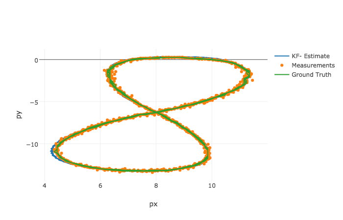
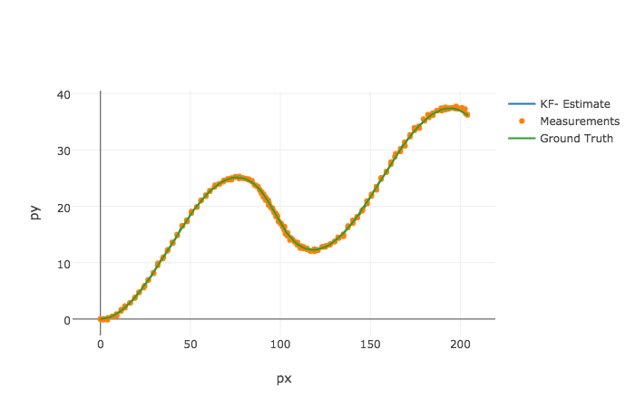

# PipeLine

# Test Data Description
### Input Data Format
L(for laser) meas_px meas_py timestamp gt_px gt_py gt_vx gt_vy

R(for radar) meas_rho meas_phi meas_rho_dot timestamp gt_px gt_py gt_vx gt_vy

---
#### Example
---
R	8.60363	0.0290616	-2.99903	1477010443399637	8.6	0.25	-3.00029	0

L	8.45	0.25	1477010443349642	8.45	0.25	-3.00027	0 

### Output file format:
est_px est_py est_vx est_vy meas_px meas_py gt_px gt_py gt_vx gt_vy

# How to run
executable file is `cmake-build-debug/EKF`

run commands:

`cd cmake-build-debug/`

`./EKF input_file output_file`,

 eg:

`./EKF ../data/sample-laser-radar-measurement-data-1.txt ../data/ekf_output_1.txt
`

# Result
### result1
input_file: sample-laser-radar-measurement-data-1.txt 

output_file: ekf_output_1.txt

### result2
input_file: sample-laser-radar-measurement-data-2.txt 

output_file: ekf_output_2.txt

